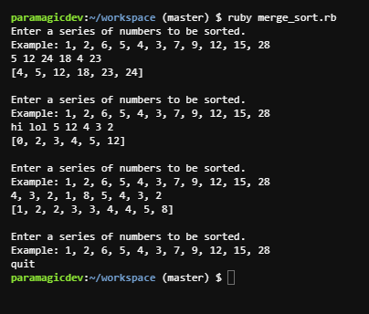

# merge_sort
Merge sort demonstration via recursion

## Description

* Merge sort algorithm to be solved recursively.
* Made & Tested w/ Ruby 2.4.1
* Must have ruby installed to use.

## Usage

* Fork the repo
* Go to command line terminal (intended for unix based systems)
*     cd ~/merge_sort
*     ruby merge_sort.rb
* It will ask for a series of numbers
* IE: 1, 5, 4, 3, 12
* Will return the sorted list of 1, 3, 4, 5, 12
* Will sanitize input to allow for mistakes

## Screenshot

